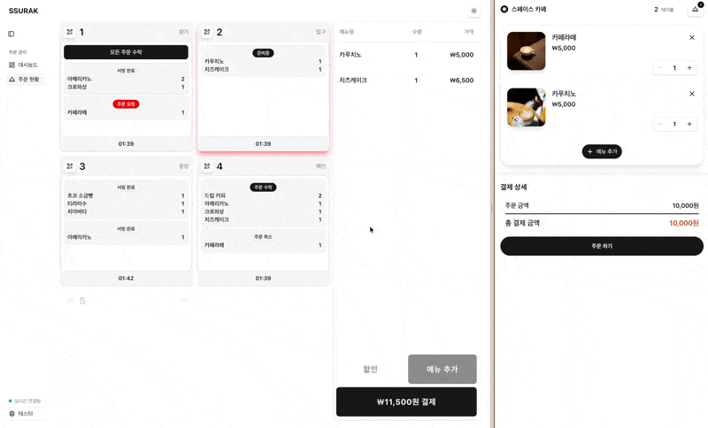
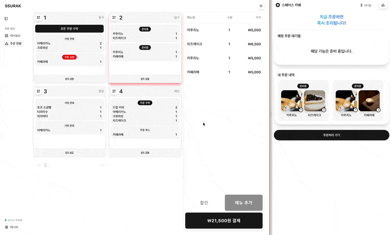
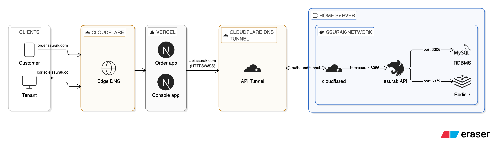
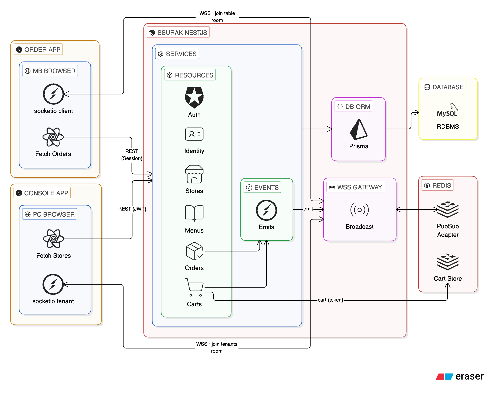
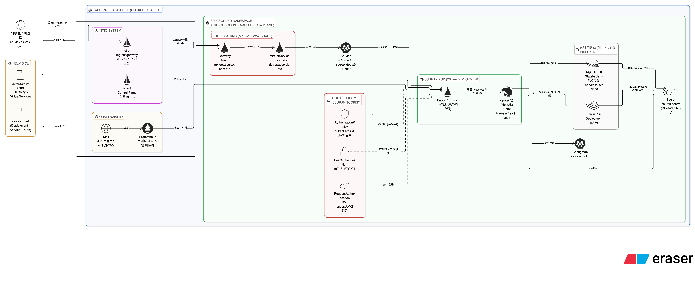

# ssurak — Frontend

> **오프라인 주문의 형태를 재설계하다.**

📦 **이 저장소는 프론트엔드 전용입니다.** 고객용 주문 앱(`order`)과 매장 관리자용 콘솔 앱(`console`), 그리고 두 앱이 공유하는 패키지를 담고 있습니다. 관련 저장소는 아래와 같습니다.

| Repository                                                     | 내용                                       |
| -------------------------------------------------------------- | ------------------------------------------ |
| **`ssurak-frontend`**                                          | Next.js 앱(order · console) + 공유 패키지  |
| [`ssurak-backend`](https://github.com/kisn3089/ssurak-backend) | NestJS API, Prisma/MySQL, Redis, Socket.IO |
| [`ssurak-infra`](https://github.com/kisn3089/ssurak-infra)     | Kubernetes + Istio 인프라                  |

카페나 음식점에서 주문할 때, 직접 대면으로 주문하거나 키오스크, 테이블에 비치된 전용 디바이스를 사용합니다.

**고객마다 모바일 디바이스를 가지고 있는데, 왜 별도의 하드웨어를 매장에 두어야 할까요?**

ssurak 프로젝트는 이 질문에서 시작되었습니다.

## BYOD (Bring Your Own Device)

고객의 스마트폰으로 QR 코드를 스캔하면 바로 주문이 가능합니다. 별도의 앱 설치 없이 브라우저에서 동작하며, 어떤 디바이스에서든 동일한 경험을 제공합니다.

| 고객 혜택                        | 사업주 혜택                            |
| -------------------------------- | -------------------------------------- |
| 점원과 마주하지 않고 편하게 주문 | 인건비 절감                            |
| 상세한 메뉴 정보로 더 나은 선택  | 하드웨어 구독 비용 불필요              |
| 대기 없이 빠른 주문              | 메뉴/품절 상태/테이블 정보 실시간 관리 |

## 확장 가능성

- 테이블별 시간 제한 설정
- 이벤트 및 할인 빠른 적용
- 주문과 동시에 선결제 유도
- 주문 데이터 기반 인사이트
- 재고 관리 서비스 (알림)
- OpenAPI 확장으로 AI Agent를 통한 주문 시스템

ssurak은 오프라인 주문을 소프트웨어와 접목시켜 **고객과 사업주를 End-to-End로 연결**하는 서비스입니다.

---

## Key Features

- **QR 코드 기반 주문**: 고객이 테이블의 QR 코드를 스캔하면 세션이 생성되고, 별도의 앱 설치 없이 브라우저에서 바로 주문
- **실시간 주문 현황**: `Socket.IO` 기반으로 매장 관리자(console)와 고객(order)에게 주문/장바구니 변경을 실시간 브로드캐스트 (새로고침 불필요)
- **실시간 장바구니**: 세션 단위 장바구니를 `Redis`에 저장하고 `Redlock` 분산 락으로 동시 수정 충돌을 방지
- **같은 테이블 간 주문 맥락 실시간 공유**: 동일한 테이블을 공유하는 고객끼리 같은 장바구니와 주문 내용을 실시간으로 공유
- **동시 주문 시 중복 생성 방지**: `Idempotency-Key`로 동시에 동일한 요청이 올 경우 중복 주문 생성 방지
- **주문 상태 관리**: `PENDING` → `ACCEPTED` → `PREPARING` → `COMPLETED` 흐름으로 주문 처리
- **테이블 세션 관리**: 테이블별 세션으로 주문 그룹화 및 결제 관리
- **메뉴 옵션 시스템**: 필수 옵션과 선택 옵션을 지원하는 유연한 메뉴 구성
- **JWT 인증 & 권한 분리**: 관리자(JWT)·고객(세션) 인증을 분리하고, WebSocket 핸드셰이크에서도 Origin·쿠키 기반으로 인증/룸 권한을 검증
- **격리된 사설 배포**: `Cloudflare Tunnel`을 통한 아웃바운드 연결로 DB/캐시/API를 외부에 노출하지 않고 운영

## Web UI

<table>
  <tr>
    <td colspan="2"><b>주문 현황 페이지</b><br/></td>
  </tr>
  <tr>
    <td><b>주문 상태 업데이트</b><br/></td>
    <td><b>동일한 테이블 고객 간의 장바구니 및 주문 공유</b><br/></td>
  </tr>
</table>

<video src="https://github.com/user-attachments/assets/c4fdf95b-a14c-4d05-be72-51f88ef26382"></video>

**주문 현황 페이지:** 매장의 모든 테이블과 주문 상태를 한눈에 확인할 수 있는 대시보드입니다. 테이블별로 현재 주문 내역과 상태가 Socket.IO를 통해 실시간으로 표시됩니다.

**주문 상태 업데이트:** 관리자가 주문 상태를 변경하면 Socket.IO를 통해 고객 화면과 다른 관리자 화면에 실시간으로 반영됩니다. 네트워크 오류 등으로 변경이 실패할 경우 사용자에게 명확한 피드백을 제공합니다.

**동일한 테이블 고객 간 장바구니 및 주문 공유:** 같은 테이블을 공유하는 고객끼리 동일한 장바구니와 주문 내용을 실시간으로 공유하여, 여러 디바이스에서 함께 주문을 구성할 수 있습니다.

## Deployment Front Services

| 도메인                                             | 설명                                               |
| -------------------------------------------------- | -------------------------------------------------- |
| [`order.ssurak.com`](https://order.ssurak.com)     | 고객이 QR을 통해 주문하는 도메인                   |
| [`console.ssurak.com`](https://console.ssurak.com) | 매장 관리인이 주문 상태를 실시간 모니터링하는 콘솔 |

### Demo Playground

[`console.ssurak.com`](https://console.ssurak.com)에서 데모 계정으로 콘솔을 체험할 수 있습니다.

- **ID**: `demo@ssurak.com`
- **PW**: `demo1234!`

## Architecture

ssurak은 QR 코드 기반 테이블 주문 시스템으로, 고객용 주문 앱(order)과 매장 관리자용 콘솔 앱(console), 그리고 백엔드 API(ssurak)로 구성됩니다. 아래 다이어그램은 **시스템 전체**를 보여주며, 이 저장소가 담당하는 범위는 order·console 두 앱입니다. 두 앱은 백엔드와 REST + Socket.IO로만 통신하고 DB에 직접 접근하지 않습니다.

### Deployment Architecture

_프론트엔드는 Vercel, 백엔드는 홈 서버에서 동작하며 Cloudflare Tunnel로 연결되는 배포 아키텍처_


- **Cloudflare Edge DNS**가 도메인별로 트래픽을 라우팅합니다.
  - `order.ssurak.com`, `console.ssurak.com` → **Vercel** (Next.js 앱)
  - `api.ssurak.com` → **Cloudflare Tunnel** → 홈 서버 `ssurak:8080`
- 백엔드(`ssurak`)와 데이터베이스(MySQL `:3306`), 캐시(Redis `:6379`)는 모두 `ssurak-network` 내부에 격리되어 **외부에 포트를 직접 노출하지 않습니다.**
- 홈 서버의 `cloudflared`가 **아웃바운드 터널**을 맺어 포트 포워딩과 인바운드 방화벽 개방 없이 외부 요청을 수신합니다 (HTTPS/WSS).
- `*.ssurak.com` 서브도메인을 공유하므로 인증 쿠키가 **same-site**로 동작합니다 (`COOKIE_DOMAIN=.ssurak.com`).

### Runtime Architecture

_Socket.IO와 Redis Adapter 기반의 실시간 통신, 서비스 간 의존 관계를 나타내는 런타임 아키텍처_


- **order app**은 고객 세션(REST + WSS) 기반으로 자신의 테이블 룸(`store:{id}:table:{id}`)에 연결되어 주문/장바구니 변경을 실시간 수신합니다.
- **console app**은 관리자 JWT(REST + WSS) 기반으로 매장 룸(`store:{id}:admins`)을 구독하여 주문 현황을 실시간 모니터링합니다.
- **ssurak**의 도메인 서비스(Auth, Identity, Stores, Menus, Orders, Carts)가 이벤트를 발행(emit)하면 **WSS Gateway**가 해당 룸으로 브로드캐스트합니다.
- **Redis 7**은 두 가지 역할을 수행합니다.
  - **Pub/Sub Adapter**: Socket.IO Redis Adapter로 다중 인스턴스 간 메시지를 동기화 (수평 확장 대비)
  - **Cart Store**: 세션 토큰 단위(`cart:{sessionToken}`)로 장바구니를 저장하고 Redlock 분산 락으로 동시성을 제어
- **Prisma ORM**을 통해 SQL을 생성하고 MySQL과 통신합니다.

### Infrastructure (Kubernetes + Istio)

> ⚠️ **현재 개발 단계에만 적용 중입니다.** 운영 환경은 위 _Deployment Architecture_(Docker Compose + Cloudflare Tunnel)로 동작하며, 아래 구성은 로컬 Kubernetes(Docker Desktop)에서 검증 중인 차세대 인프라입니다. (`api.dev.ssurak.com`)

Repository: https://github.com/kisn3089/ssurak-infra

_Kubernetes 클러스터 위에 Istio 서비스 메시를 도입하여 트래픽 관리·보안·관측성을 애플리케이션 코드에서 인프라 계층으로 분리한 고도화 아키텍처_


- **Service Mesh (Istio)**: `istiod`(컨트롤 플레인)가 각 Pod에 Envoy 사이드카를 주입하고, `istio-ingressgateway`가 L7 진입점 역할을 합니다 (`istio-injection-enabled` 네임스페이스).
- **Edge Routing**: `Gateway` + `VirtualService`(Helm: api-gateway chart)로 `api.dev.ssurak.com` 트래픽을 ssurak `Service`로 라우팅합니다.
- **Zero-Trust 보안 (ssurak scoped)**: 인증/인가를 메시 계층으로 내려, 애플리케이션은 검증된 요청만 처리합니다.
  - `PeerAuthentication` — 메시 내부 서비스 간 통신을 **mTLS STRICT**로 강제
  - `RequestAuthentication` — JWT(issuer/JWKS) 서명 검증을 메시 계층에서 수행
  - `AuthorizationPolicy` — 경로·클레임 기반 접근 제어(공개 경로 외 JWT 필수)
- **고가용성**: ssurak `Deployment`를 다중 레플리카(3 replicas)로 구성하고, 각 Pod에 liveness/readiness probe를 적용
- **상태 저장소 분리**: MySQL 8.0은 `StatefulSet`(PVC + headless Service, 3306), Redis 7은 `Deployment`(6379)로 운영
- **설정/시크릿 분리**: `ConfigMap`(비민감 설정) / `Secret`(DB·JWT·Redis 자격증명)
- **관측성**: `Kiali`로 메시 트래픽을 시각화하고 `Prometheus`로 메트릭을 수집

> [Architecture Decision Records (ADRs)](https://www.notion.so/ACCEPTOR-2a6b9430272080a380e2cd2c6ec17556)

## Tech Stack

### 이 저장소

| Category             | Technology                               |
| -------------------- | ---------------------------------------- |
| **Monorepo**         | Turborepo + pnpm workspaces              |
| **Framework**        | Next.js 16 (App Router), React 19        |
| **Compiler**         | React Compiler (`reactCompiler: true`)   |
| **Styling**          | Tailwind CSS v4, Shadcn UI, Lucide Icons |
| **State Management** | TanStack Query (React Query) v5          |
| **Data Table**       | TanStack Table v8 (console)              |
| **Form**             | React Hook Form, Zod                     |
| **HTTP / Realtime**  | axios, socket.io-client                  |
| **DevOps**           | Docker, Nginx                            |
| **Hosting**          | Vercel                                   |

### 백엔드 ([`ssurak-backend`](https://github.com/kisn3089/ssurak-backend))

| Category         | Technology                           |
| ---------------- | ------------------------------------ |
| **Backend**      | NestJS 11, Passport.js, Swagger      |
| **Database**     | MySQL 8.0, Prisma ORM                |
| **Realtime**     | Socket.IO, Redis 7 (Pub/Sub Adapter) |
| **Cache / Lock** | Redis 7 (Cart Store), Redlock        |
| **DevOps**       | Docker Compose, Cloudflare Tunnel    |
| **Hosting**      | Home Server                          |

## Project Structure

```text
frontend/
├── apps/
│   ├── order/          # 고객용 주문 앱 (Next.js 16, port 3000)
│   │   ├── Dockerfile
│   │   ├── docker-compose.prod.yml
│   │   └── nginx.conf
│   └── console/        # 관리자용 콘솔 앱 (Next.js 16, port 3001)
│       ├── Dockerfile
│       ├── docker-compose.yml
│       └── nginx.conf
├── packages/
│   ├── api/            # 도메인 타입, Axios 클라이언트, React Query 훅, Zod 스키마
│   ├── auth/           # JWT 토큰 타입/유틸, 인증 Provider
│   ├── ui/             # Radix UI 기반 공통 컴포넌트 (Tailwind v4)
│   ├── lintconfig/     # ESLint 9 FlatConfig
│   └── tsconfig/       # 공유 TypeScript 설정
├── docs/               # 문서 및 아키텍처 이미지
└── turbo.json
```

### Shared Packages

`@ssurak/api`가 백엔드와의 계약을 전담합니다. 백엔드 분리 이후 Prisma 타입 대신 **API 응답 형태를 직접 선언**합니다 — 서버 내부용 `id`는 응답에 포함되지 않으므로 선언하지 않고, 식별자는 `publicId`(cuid2)이며 날짜는 ISO `string`입니다.

```text
packages/api/src/
├── types/          # 엔티티별 응답 타입 (menu, order, table, cart, board, ...)
├── core/           # 도메인별 HTTP 함수 + React Query mutation 훅
│   ├── axios/      # axios 인스턴스, 인증 인터셉터
│   ├── auth/       # 로그인 / 토큰 갱신
│   ├── identity/   # admin · owner · me
│   ├── store/      # store · table · session
│   ├── order/      # order · order-item
│   └── cart/       # 세션 장바구니
├── hooks/          # useQueryWithAuth, useSuspenseWithSession, ...
├── schemas/        # Zod 스키마 (폼 · 페이로드 검증)
└── utils/
```

배럴(`index.ts`)을 두지 않고, `package.json`의 `exports` 서브패스 맵으로 모듈을 직접 노출합니다.

```typescript
import { OrderStatus } from "@ssurak/api/types/order/order.interface";
import { httpOrder } from "@ssurak/api/core/order/order/httpOrder";
import useSuspenseWithAuth from "@ssurak/api/hooks/useSuspenseWithAuth";
```

## Getting Started

### Prerequisites

- Node.js >= 22
- pnpm >= 9.0.0
- **실행 중인 백엔드 API (8080).** [`ssurak-backend`](https://github.com/kisn3089/ssurak-backend)를 클론해 API 서버와 MySQL·Redis를 먼저 띄우세요. 이 저장소만으로는 앱이 데이터를 받지 못합니다.

### Quick Start

#### 1. Clone the repository

```bash
git clone https://github.com/kisn3089/space-order
cd space-order
```

#### 2. Install dependencies

```bash
pnpm install
```

#### 3. Configure environment

각 앱의 `.env.example`을 복사합니다. 로컬 기본값(백엔드 `http://localhost:8080`)이 채워져 있습니다.

```bash
cp apps/order/.env.example apps/order/.env
cp apps/console/.env.example apps/console/.env
```

#### 4. Run the dev servers

```bash
pnpm dev             # order(3000) + console(3001) 동시 실행
```

#### 5. Test Demo Process

- Open http://localhost:3001
  - Email: demo@ssurak.com
  - Password: demo1234!

### Access Services

| Service          | URL                        | Description                  |
| ---------------- | -------------------------- | ---------------------------- |
| **order**        | http://localhost:3000      | 고객용 주문 앱 (이 저장소)   |
| **console**      | http://localhost:3001      | 관리자용 콘솔 앱 (이 저장소) |
| **ssurak**       | http://localhost:8080      | 백엔드 API (별도 저장소)     |
| **Swagger Docs** | http://localhost:8080/docs | API 문서 (백엔드 실행 시)    |

## Development

```bash
# 개발 서버
pnpm dev             # 두 앱 모두
pnpm dev:order       # 고객 앱 (3000)
pnpm dev:console     # 관리자 앱 (3001)
```

### Build & Quality

```bash
pnpm build         # 전체 빌드
pnpm lint          # ESLint 검사 (--max-warnings 0)
pnpm format        # Prettier 포맷팅
```

> ⚠️ `pnpm check-types`는 현재 `@ssurak/ui`에만 스크립트가 정의되어 있어 나머지 패키지를 검증하지 않습니다. 타입 검증은 해당 패키지에서 `npx tsc --noEmit`으로 실행하세요.

husky pre-push 훅이 `pnpm build`를 실행하므로, 빌드가 깨진 상태로는 push할 수 없습니다.

## Domain Types

백엔드 분리 이후 프론트엔드는 Prisma 타입을 참조하지 않고, **API 응답 형태를 `packages/api/src/types/`에 직접 선언**합니다. 서버 내부용 `id`는 응답에 포함되지 않으므로 선언하지 않으며, 식별자는 `publicId`(cuid2), 날짜는 ISO `string`입니다.

| Type             | Description                                 |
| ---------------- | ------------------------------------------- |
| **Admin**        | 시스템 관리자 (SUPER, SUPPORT, VIEWER 역할) |
| **Owner**        | 매장 사장님                                 |
| **Store**        | 매장 정보                                   |
| **Table**        | 매장 테이블 (QR 코드 포함)                  |
| **Menu**         | 메뉴 (필수/선택 옵션 지원)                  |
| **Order**        | 주문                                        |
| **OrderItem**    | 주문 항목 (옵션 스냅샷 포함)                |
| **TableSession** | 테이블 세션 (주문 그룹화)                   |
| **Cart**         | 세션 장바구니 (백엔드에서 Redis에 저장)     |

복합 응답은 유틸리티 타입으로 파생시킵니다 — `OrderWithItemsResponse`, `CategoryWithMenusResponse`, `StoreContextResponse`, `BoardTableWithSessionResponse` 등.

> 진행 중인 장바구니(Cart)는 영속 모델이 아니라 세션 단위로 **Redis**에 저장되며, 주문 확정 시 Order/OrderItem으로 전환됩니다.

### Order Status Flow

```text
PENDING → ACCEPTED → PREPARING → COMPLETED
    ↓
CANCELLED
```

### Table Session Status Flow

```text
WAITING_ORDER → ACTIVE → PAYMENT_PENDING → CLOSED
```

## Environment Variables

루트 `.env`가 아니라 **앱별 `.env`** 를 사용합니다. 각 앱의 `.env.example`을 복사해서 시작하세요.

| Variable                          | 사용처         | Description                                         | Local Default           |
| --------------------------------- | -------------- | --------------------------------------------------- | ----------------------- |
| `NEXT_PUBLIC_API_SSURAK_URL`      | order, console | 백엔드 API URL (브라우저 클라이언트용)              | `http://localhost:8080` |
| `NEXT_PUBLIC_SSURAK_INTERNAL_URL` | order, console | 백엔드 API URL (서버 컴포넌트/라우트 핸들러용)      | `http://localhost:8080` |
| `NEXT_PUBLIC_ORDER_APP_URL`       | console        | 고객 앱 URL (테이블 QR 코드 생성)                   | `http://localhost:3000` |
| `COOKIE_DOMAIN`                   | console        | 인증 쿠키 도메인 (서브도메인 공유, production 전용) | `.ssurak.com`           |

DB·Redis·JWT 시크릿 등 나머지 설정은 [`ssurak-backend`](https://github.com/kisn3089/ssurak-backend)에서 관리합니다.
